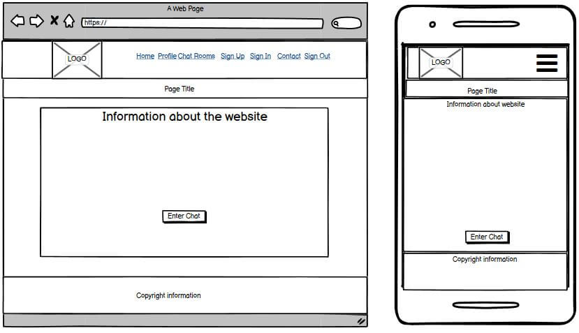

# Chat To The Mat
Chat To The Mat is an online chat service where users can create online friendships. A premium subscription service 
is available to users that allows access to our 'Gold Rooms' and enables the private messaging functionality.

## Table of Contents
* [User Experience Design (UX)](#User-Experience-Design)
    * [The Strategy Plane](#The-Strategy-Plane)
        * [Site Goals](#Site-Goals)
        * [User stories](#User-Stories)
    * [The Scope Plane](#The-Scope-Plane)
    * [The Structure Plane](#The-Structure-Plane)
    * [The Skeleton Plane](#The-Skeleton-Plane)
        * [Wireframes](#Wireframes)
        * [Database Design](#Database-Design)
        * [Security](#Security)
    * [The Surface Plane](#The-Surface-Plane)
        * [Design](#Design)
            * [Colour Scheme](#Colour-Scheme)
            * [Typography](#Typography)
            * [Imagery](#Imagery)
    * [Differences to Design](#Differences-to-Design)
- [Features](#Features)
    * [Existing Features](#Existing-Features)
    * [Future Features](#Features-Left-to-Implement)
* [Technologies](#Technologies)
* [Testing](#Testing)
    * [Test Strategy](#Test-Strategy)
    * [Test Results](#Test-Results)
    * [Isses and Resolutions](#Issues-and-Resolutions-to-issues-found-during-testing)
* [Deployment](#Deployment)
    * [Project Creation](#Project-Creation)
    * [Heroku Deployment](#Deployment-To-Heroku)
    * [Run Locally](#Run-Locally)
    * [Fork Project](#Fork-Project)
* [Credits](#Credits)
  * [Content](#Content)
  * [Acknowledgements](#Acknowledgements)

****

## User Experience Design
### **The Strategy Plane**
Chat To The Mat is the idea of client Sarah C who would like her own chat application that is designed to her requirements. During the 
global pandemic of Covid-19, Sarah has found herself quite lonely and although there are many chat applications available, she has failed 
to find one she enjoys.

Sarah would like the application to have a premium subscription service where she can chat with other people from around the globe who are 
also serious about building deep friendships whilst also offering limited availability to non subscription users. One of the things she 
worries about is people abusing the website and other users, so she would like to be able to appoint moderators who have the ability to 
ban users who post malicious or abusive content, that spam or cause general upset with the other chat users.

The aim is to build a responsive chat application where only registered users can enter the chat rooms. Security features will be implemented 
and users must be verified before being able to access the main functionality of the site. User groups will be created in order to allow 
moderators to ban users who break the terms of conditions outlined for the site. Additional groups will be created that allow access to premium 
features and areas of the site that are available once a paid subscription has been processed.

#### Site Goals
* To give users a friendly chat environment that they can use to build online friendships. 
* To ensure that moderators are in place so that users can report any bullying, harrassment or offensive content.
* To offer premium subscription services to users in order to monetize the website for the owners profit.

#### User stories
* As a user, I want the main purpose of the site to be clear so that I immediately know what the site is intended for upon entering.
* As a user, I want to easily navigate the site so that I can find content quickly with ease on any device.
* As a user, I want to be able to chat with other users in the chatroom in a safe and moderated environment.
* As a user, I want to have the option of a subscription to access premium content that I may be interested in.
* As a user, I want to be able to contact the staff of the website incase I have any issues with the site or encounter issues with other users.
* As a user, I want to be in control of my account information and have the option to update my personal information or delete my account.

* As a premium user, I want to be able to private chat with other members so that I can gain deeper friendships with selected users.
* As a premium user, I want to be able to access other areas that are not available to non subscription members.
* As a premium user, I want to be able to customize my profile with my own personal images so that I stand out.

### **The Scope Plane**

**Features planned:**
* Responsive Design - Site should function on mobile, tablet and desktop/laptop devices.
* Mobile and desktop navigations.
* Website information clearly relayed upon entering the home page.
* Terms of service must be available on the website to allow users to understand what is acceptable and non acceptable behaviour.
* User groups for moderators, users and premium users.
* Free chat rooms for non subscription members.
* Gold chat rooms available for premium users.
* Profile image uploads available to premium users.
* Private messaging functionality enabled for premium users.
* Contact form available to all users so they can contact the site owner / moderators.

### **The Structure Plane**

User Story:

> As a user, I want the main purpose of the site to be clear so that I immediately know what the site is intended for upon entering.

Acceptance Criteria:
* Heading displayed on the main page with clear information on what the site purpose is.

Implementation:

User Story:

> As a user, I want to easily navigate the site so that I can find content quickly with ease on any device.

Acceptance Criteria:
* Navigation menu to allow users to navigate the site with ease.
* Mobile menu to allow users to navigate the site from a mobile that is collapsible.
* All navigation links should navigate to the correct pages.
* Side navigation to specific chat rooms on larger devices.

Implementation:

User Story:

> As a user, I want to be able to chat with other users in the chatroom in a safe and moderated environment.

Acceptance Criteria:
* Chat rooms for users to have real time conversations with other users.
* Functionality to allow moderators to remove messages and ban users who break the terms of service.

Implementation:

User Story:

> As a user, I want to have the option of a subscription to access premium content that I may be interested in.

Acceptance Criteria:
* Payment functionality must be implemented that allows users to buy subscription packages.

Implementation:

User Story:

> As a user, I want to be able to contact the staff of the website incase I have any issues with the site or encounter issues with other users.

Acceptance Criteria:
* Contact form must be added that allows users to contact the staff.
* Users should be alerted when contact form was processed successfully.
* Users should be alerted when contact form was not processed successfully.

Implementation:

User Story:

> As a user, I want to be in control of my account information and have the option to update my personal information or delete my account.

Acceptance Criteria:
* A profile page is created for users where they can update their personal information.
* Users should have the functionality to delete their own account.

Implementation:

User Story:

> As a premium user, I want to be able to private chat with other members so that I can gain deeper friendships with selected users.

Acceptance Criteria:
* Users who have purchased a subscription can private message other users.
* Users who have not purchased a subscription should not be able to private message other users.

Implementation:

User Story:

> As a premium user, I want to be able to access other areas that are not available to non subscription members.

Acceptance Criteria:
* Users who have purchased a subscription can access the Gold Chat Rooms.
* Users who have not purchased a subscription should not be able to access the Gold Chat Rooms.

Implementation:

User Story:

> As a premium user, I want to be able to customize my profile with my own personal images so that I stand out.

Acceptance Criteria:
* Users who have purchased a subscription can upload profile pictures.
* Users who have not purchased a subscription cannot upload profile pictures.

Implementation:

### **The Skeleton Plane**
#### Wireframes
Home Page: 

#### Database Design

#### Security 

### **The Surface Plane**
### Design

#### Colour Scheme

#### Typography
The main heading on all pages use the 'Orbitron' font while the 
rest of the websites content uses the 'Roboto' font.

#### Imagery

## Differences to Design

****
## Features

### Existing Features

### Features Left to Implement

****
## Technologies
* [HTML](https://en.wikipedia.org/wiki/HTML)
	* This project uses HTML as the main language used to complete the structure of the Website.
* [CSS](https://en.wikipedia.org/wiki/CSS)
	* This project uses custom written CSS to style the Website.
* [JavaScript](https://en.wikipedia.org/wiki/JavaScript)
   
* [Python](https://www.python.org/)
    * This project was created using Python framework [Django](https://www.djangoproject.com/) following Model-View-Template design and 
    Object Relational Mapping.
    * Python Modules used (These can be found in the requirements.txt project file):

* [PostgreSQL](https://www.postgresql.org/)
    * PostgreSQL was used to create the relational databases used as data storage for this project.
* [Bootstrap](https://getbootstrap.com/)
    * The Bootstrap framework was used through the website for layout and responsiveness.
* [Google Fonts](https://fonts.google.com/)
	* Google fonts are used throughout the project to import the *Orbitron* and *Roboto* fonts.
* [GitHub](https://github.com/)
	* GithHub is the hosting site used to store the source code for the Website.
* [Git](https://git-scm.com/)
	* Git is used as version control software to commit and push code to the GitHub repository where the source code is stored.
* [Heroku](https://dashboard.heroku.com/apps)
    * Heroku was used to deploy the live website.
* [TinyJPG](https://tinyjpg.com/)
	* TinyJPG/TinyPNG is used to reduce the file sizes of images before being deployed to reduce storage and bandwith.
* [Google Chrome Developer Tools](https://developers.google.com/web/tools/chrome-devtools)
	* Google chromes built in developer tools are used to inspect page elements and help debug issues with the site layout and test different CSS styles.
* [balsamiq Wireframes](https://balsamiq.com/wireframes/)
	* This was used to create wireframes for 'The Skeleton Plane' stage of UX design.
* [Canva](https://www.canva.com/)
    * Canva design was used in order to create the website logo.
* [Font Awesome](https://fontawesome.com/)
    * All the Icons displayed throughout the website are Font Awesome icons.
* [Favicon](https://favicon.io/)
    * Favicon.io was used to make the site favicon 
* [Techsini](http://techsini.com/multi-mockup/index.php)
    * Multi Device Website Mockup Generator was used to create the Mock up image in this README

****
## Testing

### Test Strategy
#### **Summary**
Testing is required on all features and user stories documented in this README. 
All clickable links must redirect to the correct pages. All forms linked to PostgreSQL
must be tested to ensure they insert all given fields into the correct databases.

HTML Code must pass through the [W3C HTML Validator](https://validator.w3.org/#validate_by_uri).

CSS Code must pass through the [W3C CSS Validator](https://jigsaw.w3.org/css-validator/).

JavaScript code must pass through the [JSHint Validator](https://jshint.com/).

Python Code must pass through [PEP8 Validator](http://pep8online.com/)
#### **High Level Test Cases**

#### **Access Requirements**
Tester must have access to MongoDB in order to manually verify the insertion 
of records to users and events collections.

#### **Regression Testing**
All features previous tested during development in a local environment must be regression 
tested in production on the live website.

#### **Assumptions and Dependencies**
Testing is dependent on the website being deployed live on Heroku.

#### **Out of Scope**
Only test cases listed under High Level Test Cases will be performed as part of this 
testing effort.

### Test Results

Full test results can be found [here](TESTING.md)

****
## Deployment

### Project Creation
To create this project I used the 'git init' command in the terminal from VS Code.

I then used the 'git add .' command followed by 'git commit -m "Initial commit"' and was then prompted to create a new repository 
with the choices of public or private.

The following commands were used for version control throughout the project:

* git add *filename* - This command was used to add files to the staging area before committing.

* git commit -m "commit message explaining the updates" - This command was used to to commit changes to the local repository.

* git push - This command is used to push all committed changes to the GitHub repository.

### Deployment to Heroku

**Create application:**
1. Navigate to Heroku.com and login.
1. Click on the new button.
1. Select create new app.
1. Enter the app name.
1. Select region.

**Set up connection to Github Repository:**

1. Click the deploy tab and select GitHub - Connect to GitHub.
1. A prompt to find a github repository to connect to will then be displayed.
1. Enter the repository name for the project and click search.
1. Once the repo has been found, click the connect button.

**Set environment variables:**

**Enable automatic deployment:**
1. Click the Deploy tab
1. In the Automatic deploys section, choose the branch you want to deploy from then click Enable Automation Deploys.

### Run Locally

1. Navigate to the GitHub [Repository](https://github.com/Daisy-McG/chat_to_the_mat).
1. Click the Code drop down menu.
1. Either Download the ZIP file, unpackage locally and open with IDE (This route ends here) OR Copy Git URL from the HTTPS dialogue box.
1. Open your developement editor of choice and open a terminal window in a directory of your choice.
1. Use the 'git clone' command in terminal followed by the copied git URL.
1. A clone of the project will be created locally on your machine.

Once the project has been loaded into an IDE of choice, run the following command in the shell to install all the required packages:
> pip install -r requirements.txt

### Fork Project 

Most commonly, forks are used to either propose changes to someone else's project or to use someone else's project as a starting point 
for your own idea. - Definition from [Github Docs](https://docs.github.com/en/free-pro-team@latest/github/getting-started-with-github/fork-a-repo).

1. Navigate to the GitHub Repository you want to fork.
1. On the top right of the page under the header, click the fork button.
    
    
1. This will create a duplicate of the full project in your GitHub Repository.

****
## Credits

### Code

The css gradient for the headings was taken from [CSS-TRICKS](https://css-tricks.com/snippets/css/gradient-text/).

### Acknowledgements

****