## Test Cases and Execution Report

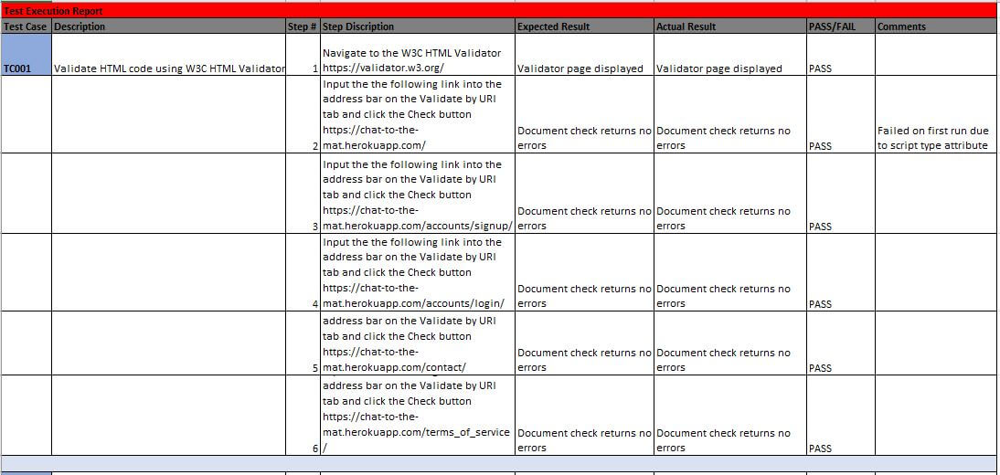
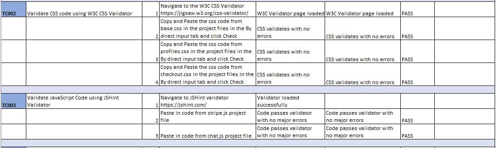
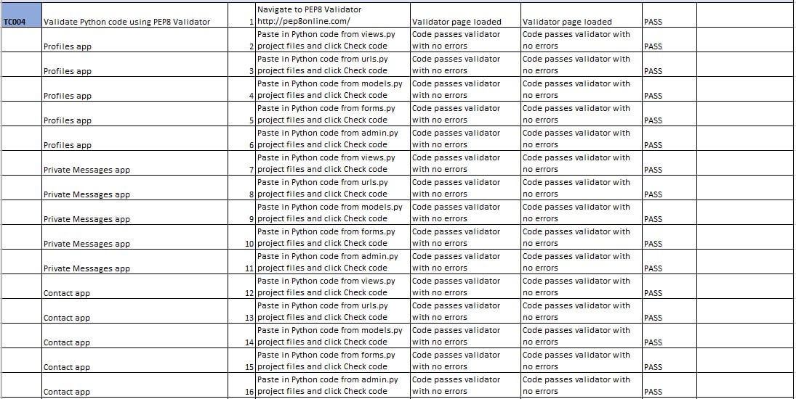
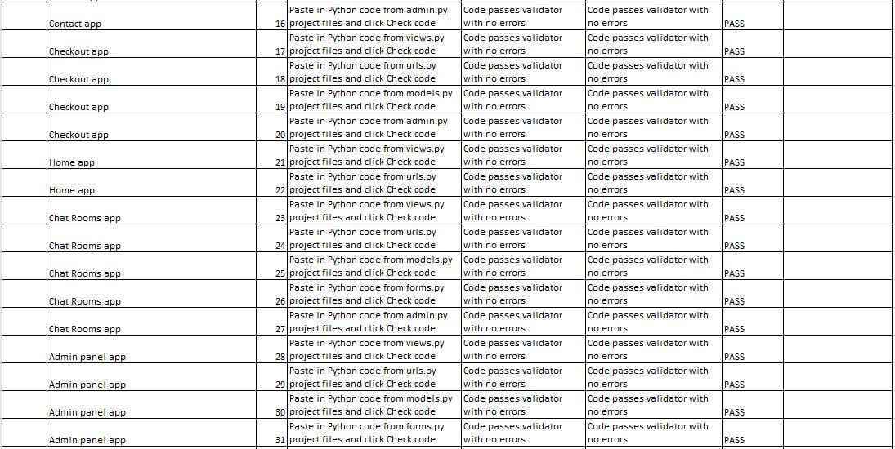
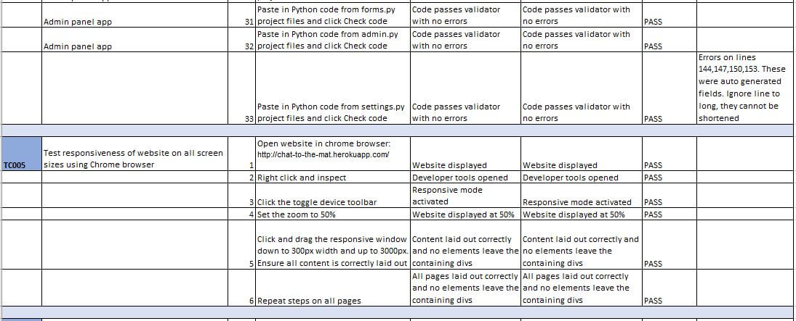
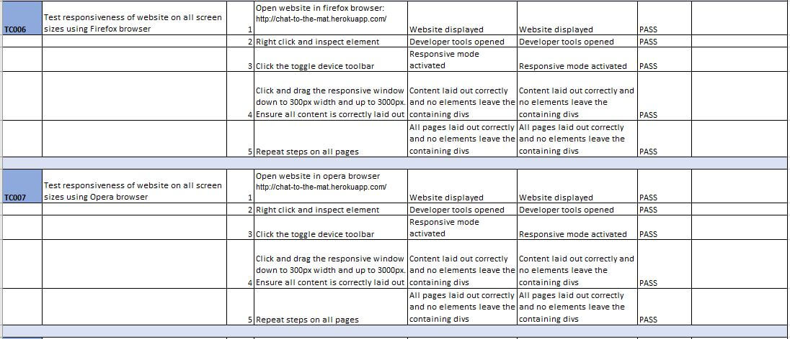
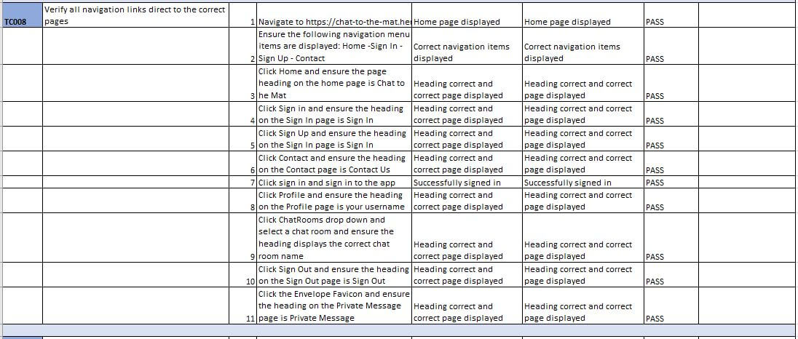
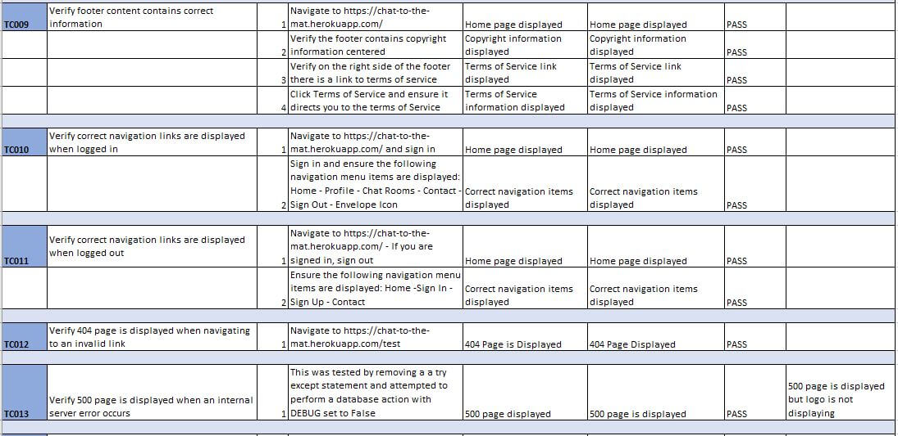
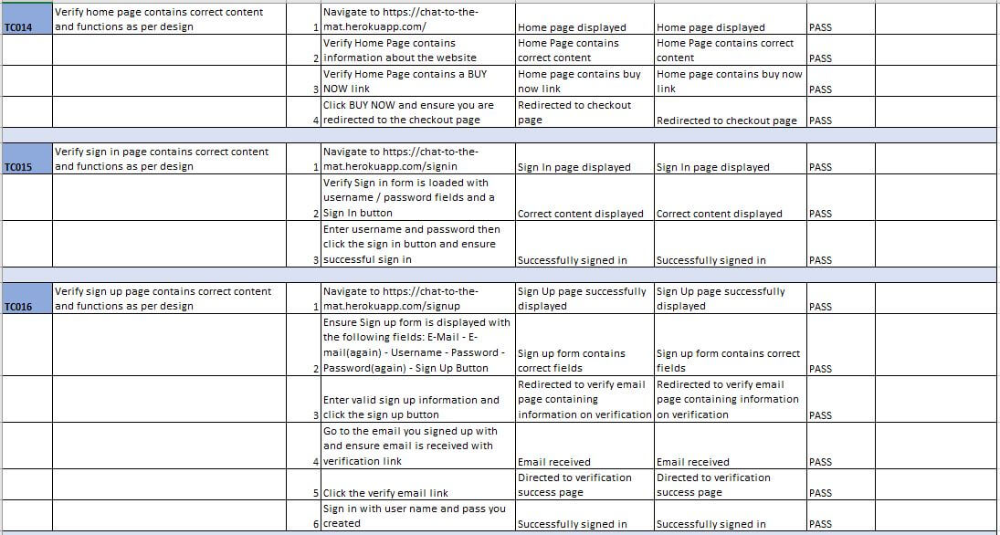
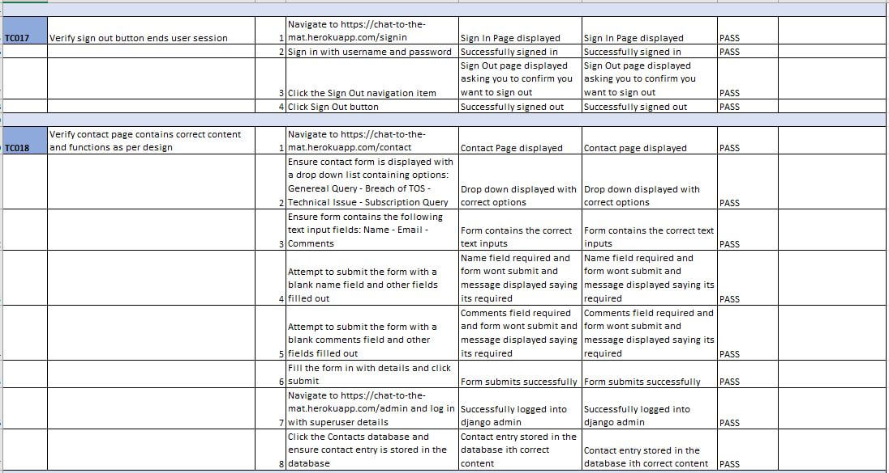
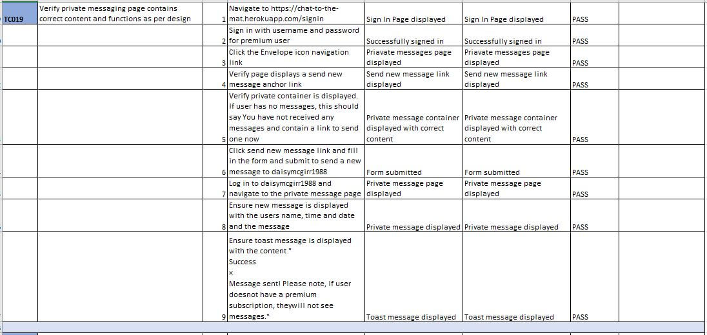
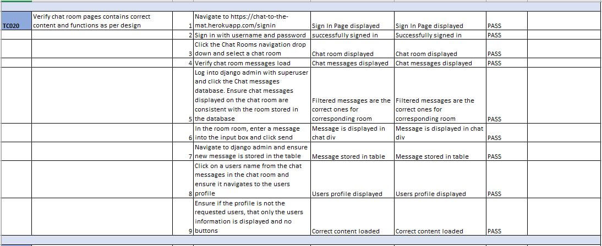
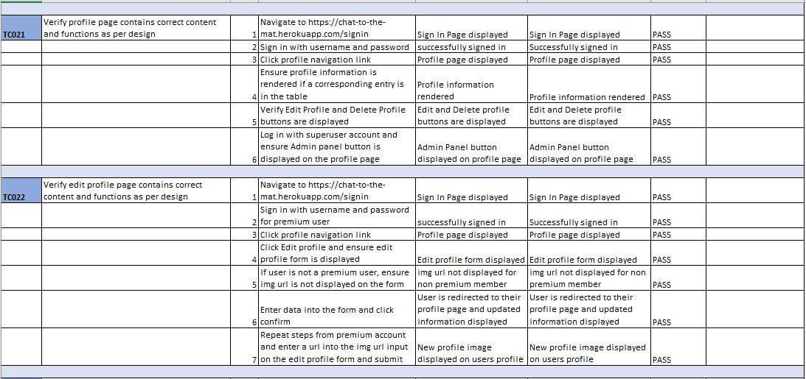

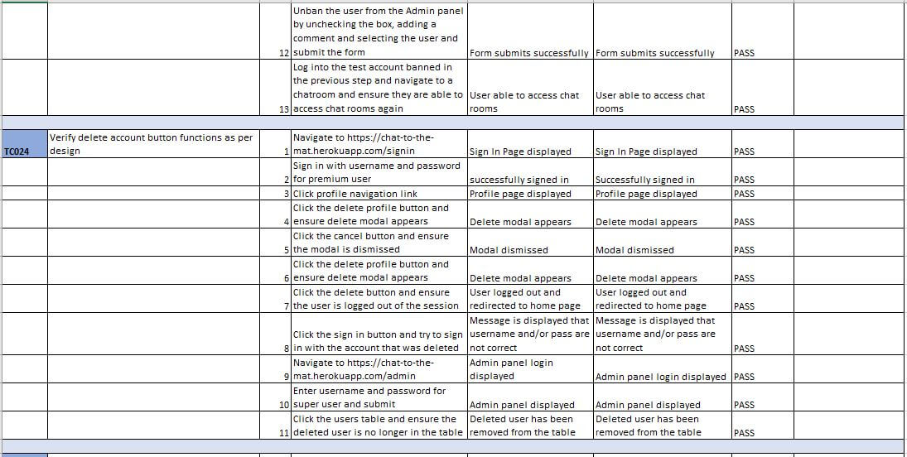
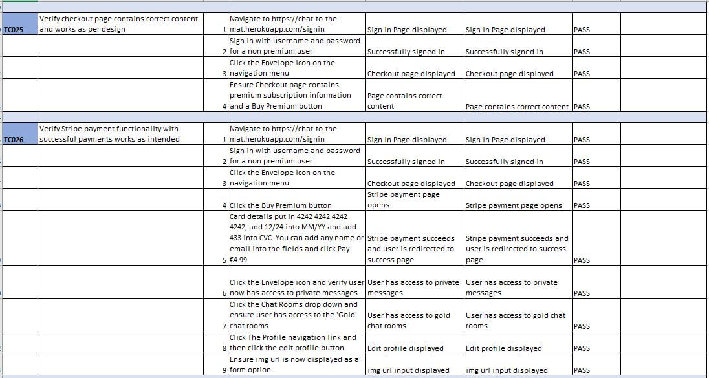
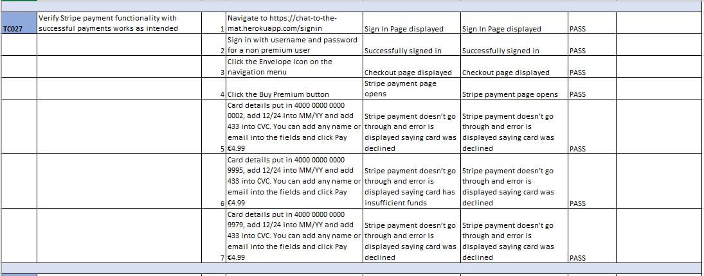
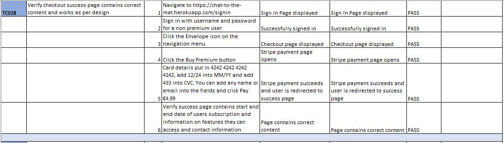
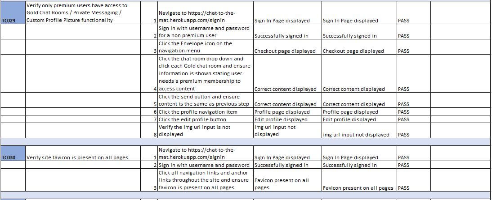
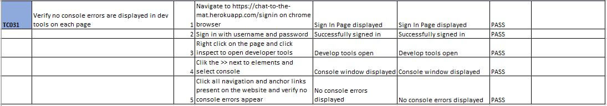

Full downloadable excel document can be found [here](readme_images/test_results_ms4.xlsx)

An additional test was done to ensure the check premium status function works as expected. This was performed by updating a previous users premium subscription end date to yesterdays date and then loading the home page. It was then verified the user had been removed from the premium user table.

Testing was also permformed on the chat rooms to ensure they only display 20 messages and that the oldest messages are deleted.

***

## Issues and Resolutions to issues found during development testing

**Issue:**

Admin Panel wasn't displaying for superusers. This was caused by the code `if user.is_superuser`.

**Resolution:**

This was resolved by updating it to `request.if user.is_superuser`.

**Issue:**

404 error image was not displaying correctly.

**Resolution:**

This was resolved by setting a max height and width and adding the img-fluid class.

**Issue:**

Chat home direct was causing an error due to refactored code and it not being updated properly. 

**Resolution:**

This was resolved by adding correct anchor link url plus added redirect to view.

**Issue:**

User was not correctly importing on profiles and chat room pages due to bad import statement.

**Resolution:**

This was resolved by updating `from .models import User` to `from django.contrib.auth.models import User`.

***

## Issues and Resolutions to issues found during testing of deployed website

Issue #1: 
> TC001 - Step 2: Failed validation on script tags having a type attribute with a warning.

FIX - This was resolved by removing the type attribute from the script tags.

Issue #2: 
> TC004 - Several Steps: Warnings and errors appeared on PEP8 Validation for several python files.

FIX - These were resolved by removing white space and adding new lines at the end of files. 
Errors on lines 144,147,150,153 are still present in settings.py. These were auto generated fields. These pieces of code were auto generated and I was unable to shorten them and the code still work.

Issue #3: 
> TC009 - Step 3: On Profile page, Terms of Service was positioned in the center and font size was smaller.

FIX - This was caused by not closing an anchor link in the content. It was resolved by correctly closing the anchor tag.

Issue #5: 
> Smoke Testing: If user goes to success page directly, premium user is created. If a user hits the back button on the checkout without completing payments the same issue happens.

FIX- This was fixed by creating a session cookie during checkout and only loading the success content and creating the premium user if the session cookie is stored.

***

## Known Bugs

505 error page Logo is not displaying or the main image. This issue has not yet been resolved but the main image has been temporarily removed.

On iphone, when in the chat rooms, if you click and swipe down to refresh. The menu icon does not always appear. If you repeat action a few times, it does reappear. I have yet to resolve this issue.

***

## Lighthouse Report

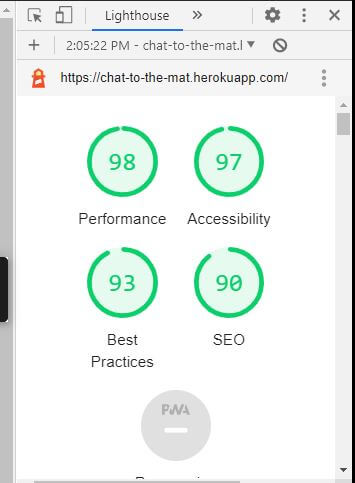

***

## Validator Results

#### HTML

**Home:** 

**Signup:** 

**Signin:** 

**Contact:** 

**Terms of Service:** 

#### CSS 

**base.css - profiles.css - checkout.css** 

#### JavaScript

**chat.js:** 
No major errors. Undefined $ is unrecognised jQuery and can be ignored. 
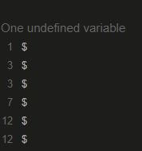

**stripe.js** 

No major errors. Arrow function warnings can be ignored and undefined variable Stripe is being used, this can also be ignored. 
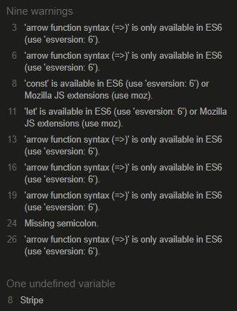

#### PEP8 Compliance

All files pass except settings.py file:  
Errors on lines 144, 147, 150, 153. These pieces of code were auto generated.

## Unit Tests

10 Unit tests were created to test views / redirects and one form validation on contact form.

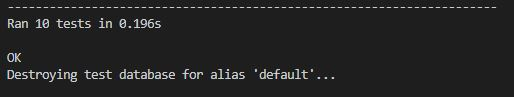
